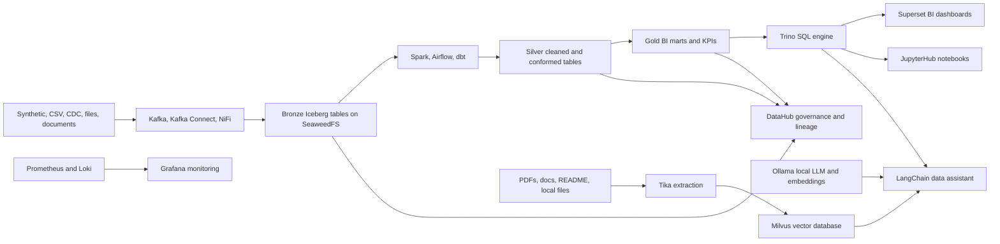

# Enterprise Data Lakehouse with BI and RAG

This repository is a Docker Compose based data platform that behaves like a small enterprise lakehouse in one local environment. It brings together ingestion, object storage, Iceberg tables, Spark/dbt transformation, SQL serving, BI dashboards, metadata governance, monitoring, and a local RAG assistant.

The easiest mental model is a house:

- The foundation is Docker Compose, PostgreSQL, SeaweedFS, Kafka, Spark, Hive Metastore, and Trino.
- The storage rooms are the Bronze, Silver, and Gold lakehouse layers.
- The workshop is Spark, Airflow, dbt, Great Expectations, and the ingestion scripts.
- The front office is Superset, JupyterHub, Grafana, DataHub, and the admin dashboard.
- The study room is the RAG stack: Tika extracts documents, Ollama runs local models, Milvus stores vectors, and the LangChain Streamlit app answers questions.

It is designed for demos, local development, and airgapped/on-prem style platform testing.

## What You Get

- End-to-end medallion lakehouse: raw Bronze data, cleaned Silver models, and analytics-ready Gold marts.
- BI layer: Apache Superset connects to Trino and reads Iceberg-backed Gold tables.
- RAG layer: local document question answering using LangChain, Ollama, Milvus, Tika, and SeaweedFS-backed files.
- Batch and streaming ingestion: Kafka, Kafka Connect, NiFi, synthetic data, and Python helpers.
- Transformation: Spark jobs and dbt models.
- Quality checks: Great Expectations and dbt tests.
- Governance: DataHub metadata ingestion, lineage assets, OpenSearch, and OpenBao.
- Observability: Prometheus, Grafana, Loki, Promtail, node exporter, and PostgreSQL exporter.
- Operations UI: Streamlit admin dashboard plus service-specific UIs.

## Repository Layout

| Path | Purpose |
| --- | --- |
| `docker-compose.yml` | Defines the full platform and service profiles. |
| `.env` | Local credentials, ports, bucket names, and service settings. |
| `Makefile` | Common startup, shutdown, test, and utility commands. |
| `start_all.ps1` | Windows PowerShell startup sequence for the full stack. |
| `start_all.sh` | Bash startup sequence for Linux/macOS. |
| `check_all.ps1`, `check_all.sh` | Health checks for the running platform. |
| `scripts/` | Data generation, ingestion, validation, setup, and demo scripts. |
| `dbt/` | dbt project for Silver and Gold lakehouse models. |
| `configs/` | Service configuration for Airflow, Trino, Spark, DataHub, Grafana, Superset, and more. |
| `dockerfiles/` | Custom images for Airflow, dbt, LangChain app, dashboards, and helper services. |
| `synthetic_data/` | Synthetic source data generator. |
| `data/` | Local mounted data area used by demos and services. |
| `docs/` | Supporting implementation and execution documentation. |

## Architecture



## Main Data Flow

1. Source data is created or received from the synthetic generator, local files, Kafka topics, or connector inputs.
2. Kafka and NiFi land raw data into the Bronze layer.
3. Spark jobs create or update Iceberg tables using SeaweedFS as S3-compatible object storage.
4. dbt transforms Bronze/Silver sources into Silver conformed models and Gold business marts.
5. Great Expectations and dbt tests validate key tables.
6. Trino exposes the Iceberg catalog for SQL.
7. Superset uses Trino datasets to build dashboards and charts.
8. DataHub ingests metadata and lineage so users can discover datasets and understand the platform.
9. Grafana and Prometheus show platform health and operational metrics.

## BI Flow

The BI path is:

```text
Source data -> Bronze -> Silver -> Gold -> Trino -> Superset dashboards
```

Gold models are the main BI surface. They include dashboard-ready tables such as:

- `gold_batch_summary`
- `gold_compliance_capa_mart`
- `gold_manufacturing_oee_mart`
- `gold_oee_dashboard`
- `gold_production_efficiency`
- `gold_quality_kpis`
- `gold_quality_risk_mart`
- `gold_sap_inventory_mart`
- `gold_training_compliance_mart`

Use Superset at [http://localhost:8500](http://localhost:8500) with `admin` / `admin`. The Trino connection points to the Iceberg catalog, so dashboards can query `iceberg.gold.*` tables.

## RAG Flow

The RAG path is:

```text
Documents -> Tika text extraction -> embeddings -> Milvus -> LangChain app -> Ollama answer
```

The LangChain app is available at [http://localhost:8501](http://localhost:8501). It can use local project documents and mounted source files as knowledge material. The compose service mounts:

- `README.md`
- `docs/`
- `data/source/`

The AI components are fully local:

- Ollama serves the chat model and embedding model.
- Milvus stores document vectors.
- Tika extracts text from documents.
- LangChain orchestrates retrieval, prompt construction, and response generation.
- Trino tools let the assistant inspect lakehouse data when enabled in the app.

Default models in `docker-compose.yml`:

- Chat model: `llama3`
- Embedding model: `nomic-embed-text`

## Prerequisites

- Docker Desktop or Docker Engine with Compose v2.
- Recommended memory: 32 GB or more for the full `all` profile.
- Recommended CPU: 8 cores or more for comfortable startup.
- Windows PowerShell, or Bash on Linux/macOS.
- Enough disk space for container images, volumes, generated data, and model weights.

For smaller machines, start profiles incrementally instead of starting everything at once.

## Quick Start on Windows

From the repository root:

```powershell
powershell -ExecutionPolicy Bypass -File .\start_all.ps1
```

This starts the stack in dependency order: core services first, then ingestion, processing, lakehouse, monitoring, analytics, AI, governance, and finally the complete profile.

Check services:

```powershell
.\check_all.ps1
docker compose --env-file .env --profile all ps
```

## Quick Start on Linux or macOS

From the repository root:

```bash
bash start_all.sh
```

Check services:

```bash
bash check_all.sh
docker compose --env-file .env --profile all ps
```

## Manual Startup by Profile

You can also bring up layers manually. This is useful when debugging or running on a smaller laptop.

```bash
make up-core
make init-buckets
make up-ingestion
make up-synthetic
make up-processing
make up-lakehouse
make up-monitoring
make up-analytics
make up-ai
make up-governance
make up-cicd
```

Full stack:

```bash
make up-all
```

Stop services:

```bash
make down
```

Stop services and remove volumes:

```bash
make clean
```

Be careful with `make clean`: it removes Docker volumes and deletes local platform state.

## Docker Compose Profiles

| Profile | Main Services |
| --- | --- |
| `core` | PostgreSQL, SeaweedFS master/volume/filer/S3, bucket initializer |
| `ingestion` | Zookeeper, Kafka, Schema Registry, Kafka Connect, Kafka UI, NiFi |
| `synthetic` | Synthetic data generator |
| `processing` | Spark, Airflow, dbt, Great Expectations, Tika, OCR helper |
| `lakehouse` | Hive Metastore, Trino, Iceberg catalog |
| `analytics` | Superset, JupyterHub, admin dashboard |
| `ai` | Ollama, Ollama model puller, Milvus, Attu, LangChain Streamlit app |
| `monitoring` | Prometheus, Grafana, Loki, Promtail, exporters |
| `governance` | OpenSearch, DataHub, Neo4j, OpenBao |
| `cicd` | GitLab CE |
| `all` | Everything |

## Important URLs and Credentials

| Service | URL | Credentials |
| --- | --- | --- |
| Airflow | [http://localhost:8280](http://localhost:8280) | `admin` / `admin` |
| Superset | [http://localhost:8500](http://localhost:8500) | `admin` / `admin` |
| LangChain RAG app | [http://localhost:8501](http://localhost:8501) | No default login |
| Admin dashboard | [http://localhost:8502](http://localhost:8502) | No default login |
| Trino UI | [http://localhost:8180](http://localhost:8180) | `admin`, no password |
| Spark master | [http://localhost:8181](http://localhost:8181) | No default login |
| Kafka UI | [http://localhost:9000](http://localhost:9000) | No default login |
| NiFi | [http://localhost:8090](http://localhost:8090) | `admin` / `adminadminadmin` |
| SeaweedFS S3 | [http://localhost:8333](http://localhost:8333) | `admin` / `admin123` |
| SeaweedFS browser/proxy | [http://localhost:8888](http://localhost:8888) | Uses S3 credentials |
| Grafana | [http://localhost:3000](http://localhost:3000) | `admin` / `admin123` |
| Prometheus | [http://localhost:9090](http://localhost:9090) | No default login |
| DataHub | [http://localhost:9002](http://localhost:9002) | `datahub` / `datahub` |
| OpenSearch | [http://localhost:9200](http://localhost:9200) | Security disabled in compose |
| OpenBao | [http://localhost:8200](http://localhost:8200) | Token: `roottoken` |
| Attu for Milvus | [http://localhost:8000](http://localhost:8000) | No default login |
| GitLab | [http://localhost:8929](http://localhost:8929) | Root password from container logs |

## Common Commands

```bash
make status
make logs svc=trino
make restart svc=lakehouse_trino
make health-check
make kafka-topics
make trino-shell
make dbt-run
make dbt-test
make show-medallion-layout
make integration-test
```

Windows equivalents can be run directly with `docker compose` or the provided PowerShell scripts.

## Running the Demo Pipeline

After the platform is healthy, run the full demo:

```bash
bash scripts/run_full_demo.sh
```

On Windows:

```powershell
powershell -ExecutionPolicy Bypass -File .\scripts\run_full_demo.ps1
```

The demo flow generates or loads source data, verifies Bronze, runs dbt Silver, tests Silver, runs Great Expectations, builds Gold models, tests Gold, and prints a final dashboard summary.

## Querying the Lakehouse

Open a Trino shell:

```bash
make trino-shell
```

Example queries:

```sql
SHOW CATALOGS;
SHOW SCHEMAS FROM iceberg;
SHOW TABLES FROM iceberg.gold;
SELECT * FROM iceberg.gold.gold_oee_dashboard LIMIT 10;
SELECT * FROM iceberg.gold.gold_quality_kpis LIMIT 10;
```

## Working with Superset

1. Open [http://localhost:8500](http://localhost:8500).
2. Log in with `admin` / `admin`.
3. Confirm the Trino database connection is available.
4. Create datasets from `iceberg.gold` tables.
5. Build charts from Gold marts.
6. Combine charts into dashboards for OEE, quality KPIs, inventory, training compliance, and CAPA/compliance views.

## Working with the RAG App

1. Confirm `ollama`, `milvus`, `tika`, and `langchain-app` are running.
2. Open [http://localhost:8501](http://localhost:8501).
3. Index project documents if the app exposes indexing controls, or run the indexing utility in `dockerfiles/langchain-app/utils/index_documents.py` from inside the app container.
4. Ask questions about the lakehouse documentation, source files, or mounted data.
5. Use Trino-backed questions when you want the assistant to reason over actual lakehouse tables.

Useful container checks:

```bash
docker logs lakehouse_ollama
docker logs lakehouse_milvus
docker logs lakehouse_langchain_app
docker exec lakehouse_ollama ollama list
```

## Storage and Table Layout

SeaweedFS acts as the S3-compatible object store. Iceberg tables store data and metadata under lakehouse buckets. The expected medallion organization is:

```text
lakehouse-bronze/
lakehouse-silver/
lakehouse-gold/
lakehouse-docs/
lakehouse-models/
```

Bronze keeps raw or lightly normalized records with ingestion metadata. Silver keeps cleaned and conformed records. Gold keeps aggregates and marts for BI and business users.

## Data Quality and Governance

Quality is handled through:

- dbt model tests in `dbt/models/**/schema.yml`.
- Great Expectations checkpoints under `configs/airflow/dags/ge_checkpoints/`.
- Validation scripts in `scripts/`.

Governance is handled through:

- DataHub recipes in `configs/datahub/`.
- Airflow and dbt lineage assets.
- OpenSearch for search/audit backing services.
- OpenBao for secrets-management demos.

## Monitoring

Open Grafana at [http://localhost:3000](http://localhost:3000). Prometheus is available at [http://localhost:9090](http://localhost:9090).

Provisioned dashboards live in:

```text
configs/grafana/provisioning/dashboards/
```

Useful monitoring checks:

```bash
docker compose --env-file .env --profile monitoring ps
curl http://localhost:9090/-/ready
curl http://localhost:3000/api/health
```

## Airgapped or Offline Usage

The stack is built to be friendly to offline environments. Prepare images before going offline:

```bash
make pull-images
make save-images
```

On the offline machine:

```bash
make load-images
```

For AI features, also pre-load Ollama model weights into the `ollama_data` volume or pull them before disconnecting:

```bash
docker exec lakehouse_ollama ollama pull llama3
docker exec lakehouse_ollama ollama pull nomic-embed-text
```

## Troubleshooting

Check container health:

```bash
docker compose --env-file .env --profile all ps
```

Tail one service:

```bash
make logs svc=lakehouse_trino
```

Check common endpoints:

```bash
bash check_all.sh
```

If Trino cannot see Iceberg tables, check Hive Metastore, SeaweedFS S3, and the Iceberg catalog config under `configs/trino/catalog/iceberg.properties`.

If Superset cannot query data, confirm Trino is healthy and the Gold models exist:

```sql
SHOW TABLES FROM iceberg.gold;
```

If the RAG app does not answer from documents, confirm Ollama models are present, Milvus is healthy, and documents have been indexed.

If the full stack is too heavy, run only the profile you need. For BI demos, the usual minimum is `core`, `ingestion`, `processing`, `lakehouse`, and `analytics`. For RAG demos, the usual minimum is `core`, `lakehouse`, `processing`, and `ai`.

## Safe Reset

To stop containers without deleting data:

```bash
make down
```

To wipe the local platform state and start fresh:

```bash
make clean
```

Use `make clean` only when you are comfortable deleting local Docker volumes for this stack.

## Next Useful Reading

- `docs/STACK_EXECUTION_GUIDE.md` for execution order and readiness notes.
- `docs/IMPLEMENTATION_PLAN.md` for planned implementation details.
- `docs/TPL_DATA_LAKEHOUSE_CLIENT_DEMO.md` for demo narrative material.
