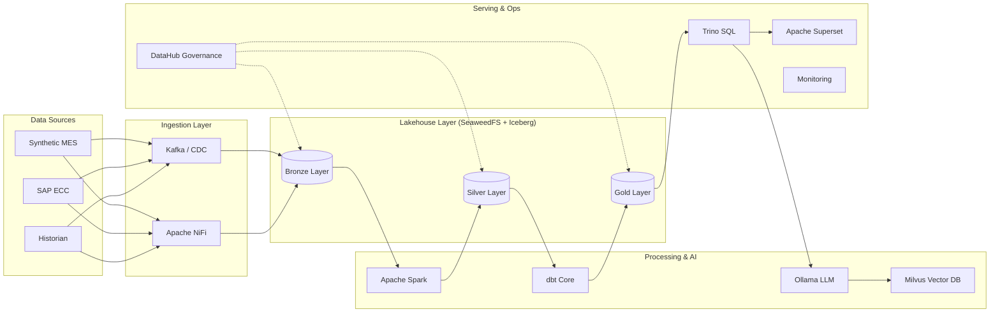

# 🚀 Enterprise End-to-End Data Lakehouse Stack

[](https://iceberg.apache.org/)
[](https://trino.io/)
[](https://seaweedfs.com/)
[](https://datahubproject.io/)

A production-ready, airgapped **Enterprise Data Lakehouse** stack built on Docker Compose. This platform features a complete Medallion architecture, AI/ML RAG pipelines, and comprehensive governance for mission-critical data engineering.

---

## 🏗️ Architecture Overview

The stack implements a modern data platform using the Medallion architecture pattern, ensuring data quality and lineage from raw ingestion to high-value analytics.



---

## 🌟 Key Pillars

### 💎 Medallion Architecture
- **Bronze**: Raw data captured via Kafka/NiFi with ALCOA+ metadata.
- **Silver**: Cleaned, filtered, and augmented data using Spark 3.5.
- **Gold**: Business-level aggregates and high-performance marts built via dbt.

### 🤖 Generative AI & RAG
- **Ollama**: Local LLM execution (Llama 3) for airgapped security.
- **Milvus**: High-performance vector database for semantic search and RAG.
- **LangChain**: Unified application framework for intelligent data assistants.

### 🛡️ Governance & Security
- **DataHub**: Automated metadata ingestion and column-level lineage.
- **OpenSearch**: Full-text audit trail and log exploration.
- **OpenBao (Vault)**: Enterprise-grade secrets management for all service credentials.

### 📊 Monitoring & Observability
- **Prometheus & Grafana**: Real-time metrics and health dashboards.
- **Loki & Promtail**: Centralized log aggregation and alerting.

---

## ⚡ Quick Start

### Prerequisites
- **Docker Desktop** (32GB+ RAM recommended)
- **Windows (PowerShell)** or **Linux/macOS (Bash)**

### Deployment
To start the entire stack in the correct dependency order, use the automated startup scripts:

**PowerShell:**
```powershell
powershell -ExecutionPolicy Bypass -File start_all.ps1
```

**Bash:**
```bash
bash start_all.sh
```

---

## 🔗 Service Registry

| Service | access Link | Default Credentials |
| :--- | :--- | :--- |
| **🚀 DataHub** | [http://localhost:9002](http://localhost:9002) | `datahub` / `datahub` |
| **📅 Airflow** | [http://localhost:8280](http://localhost:8280) | `admin` / `admin` |
| **🔍 Trino** | [http://localhost:8180](http://localhost:8180) | `admin` / (no pwd) |
| **📈 Grafana** | [http://localhost:3000](http://localhost:3000) | `admin` / `admin123` |
| **📓 JupyterHub** | [http://localhost:8400](http://localhost:8400) | `admin` / (create on login) |
| **📊 Superset** | [http://localhost:8500](http://localhost:8500) | `admin` / `admin` |
| **🤖 AI Chat** | [http://localhost:8501](http://localhost:8501) | *Guest Access* |
| **🚢 Kafka UI** | [http://localhost:9000](http://localhost:9000) | *No Auth* |
| **🔐 OpenBao** | [http://localhost:8200](http://localhost:8200) | `roottoken` |

---

## 📑 Compliance & Data Integrity

Designed for regulated environments (e.g., 21 CFR Part 11), every record in the **Bronze Layer** includes:
- `_source_system`: Attributable origin.
- `_ingested_at`: Contemporaneous timestamp.
- `_row_hash`: Accurate data validation.
- `_kafka_offset`: Enduring sequence reference.

---

> [!NOTE]
> *This stack is optimized for airgapped, on-premises deployment. All container images and LLM weights should be pre-loaded for offline environments.*

Developed for robust enterprise data engineering.