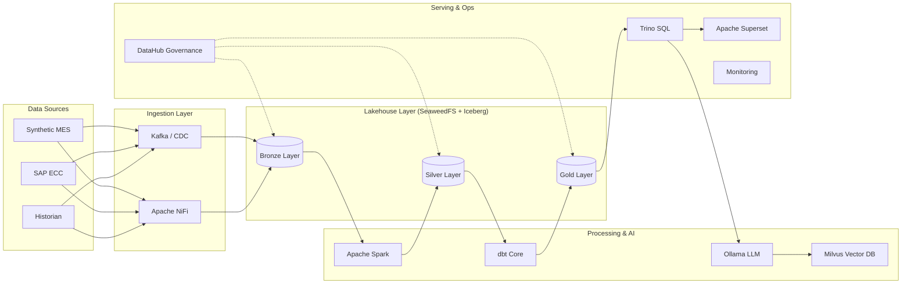

# 🚀 Enterprise End-to-End Data Lakehouse Stack

[](https://iceberg.apache.org/)
[](https://trino.io/)
[](https://seaweedfs.com/)
[](https://datahubproject.io/)

A production-ready, airgapped **Enterprise Data Lakehouse** stack built on Docker Compose. This platform features a complete Medallion architecture, AI/ML RAG pipelines, and comprehensive governance for mission-critical data engineering.

---

## Stack Guide

For the practical startup order, data execution flow, current readiness, and recommended next implementation steps, see [docs/STACK_EXECUTION_GUIDE.md](docs/STACK_EXECUTION_GUIDE.md).

---

## 🏗️ Architecture Overview

The stack implements a modern data platform using the Medallion architecture pattern, ensuring data quality and lineage from raw ingestion to high-value analytics.



---

## 🌟 Key Pillars

### 💎 Medallion Architecture
- **Bronze**: Raw data captured via Kafka/NiFi with ALCOA+ metadata.
- **Silver**: Cleaned, filtered, and augmented data using Spark 3.4.
- **Gold**: Business-level aggregates and high-performance marts built via dbt.

### 🤖 Generative AI & RAG
- **Ollama**: Local LLM execution (Llama 3) for airgapped security.
- **Milvus**: High-performance vector database for semantic search and RAG.
- **LangChain**: Unified application framework for intelligent data assistants.

### 🛡️ Governance & Security
- **DataHub**: Automated metadata ingestion and column-level lineage.
- **OpenSearch**: Full-text audit trail and log exploration.
- **OpenBao (Vault)**: Enterprise-grade secrets management for all service credentials.

### 📊 Monitoring & Observability
- **Prometheus & Grafana**: Real-time metrics and health dashboards.
- **Loki & Promtail**: Centralized log aggregation and alerting.

---

## ⚡ Quick Start

### Prerequisites
- **Docker Desktop** (32GB+ RAM recommended)
- **Windows (PowerShell)** or **Linux/macOS (Bash)**

### Deployment
To start the entire stack in the correct dependency order, use the automated startup scripts:

**PowerShell:**
```powershell
powershell -ExecutionPolicy Bypass -File start_all.ps1
```

**Bash:**
```bash
bash start_all.sh
```

---

## 🔗 Service Registry & Image Directory

| Service / Tool | Access Link / Port | Docker Image / Build | Default Credentials |
| :--- | :--- | :--- | :--- |
| **🚀 DataHub (Frontend)** | [http://localhost:9002](http://localhost:9002) | `acryldata/datahub-frontend-react:v0.14.1` | `datahub` / `datahub` |
| **🚀 DataHub (GMS)** | `tcp://8080` | `acryldata/datahub-gms:v0.14.1` | *(Internal API)* |
| **📅 Apache Airflow** | [http://localhost:8280](http://localhost:8280) | `Custom Build (Local)` | `admin` / `admin` |
| **🔍 Trino SQL** | [http://localhost:8180](http://localhost:8180) | `trinodb/trino:435` | `admin` / *(No Password)* |
| **📈 Grafana** | [http://localhost:3000](http://localhost:3000) | `grafana/grafana:10.4.2` | `admin` / `admin123` |
| **📓 JupyterHub** | [http://localhost:8400](http://localhost:8400) | `jupyter/datascience-notebook:latest` | `admin` / *(Set on first login)* |
| **📊 Apache Superset** | [http://localhost:8500](http://localhost:8500) | `apache/superset:3.1.3` | `admin` / `admin` |
| **🤖 Langchain AI Chat** | [http://localhost:8501](http://localhost:8501) | `Custom Build (Local)` | *(Guest Access)* |
| **🚢 Kafka UI** | [http://localhost:9000](http://localhost:9000) | `provectuslabs/kafka-ui:latest` | *(No Auth)* |
| **🔐 OpenBao (Vault)** | [http://localhost:8200](http://localhost:8200) | `openbao/openbao:latest` | `roottoken` *(Token)* |
| **🐘 PostgreSQL** | `tcp://5432` | `postgres:13` | `admin` / `admin123` |
| **🗃️ SeaweedFS** | [http://localhost:9333](http://localhost:9333) | `chrislusf/seaweedfs:3.63` | `admin` / `admin123` *(S3 Keys)* |
| **⚙️ Apache Kafka** | `tcp://9092` | `confluentinc/cp-kafka:7.5.0` | *(Internal)* |
| **🔄 Kafka Connect** | `tcp://8083` | `confluentinc/cp-kafka-connect:7.5.0` | *(Internal REST)* |
| **🧬 Apache NiFi** | [http://localhost:8090](http://localhost:8090) | `apache/nifi:1.23.2` | `admin` / `adminadminadmin` |
| **⚡ Apache Spark** | [http://localhost:8181](http://localhost:8181) | `bitnami/spark:3.4` | *(No Auth)* |
| **🧠 Ollama LLM** | `tcp://11434` | `ollama/ollama:0.1.44` | *(Internal API)* |
| **🎯 Milvus Vector DB** | `tcp://19530` | `milvusdb/milvus:v2.4.0` | *(No Auth)* |
| **🛡️ OpenSearch** | [http://localhost:9200](http://localhost:9200) | `opensearchproject/opensearch:2.11.0` | `admin` / `Admin@123456` |
| **🦊 GitLab CE** | [http://localhost:8929](http://localhost:8929) | `gitlab/gitlab-ce:16.7.0-ce.0` | *(Root Password in Logs)* |
| **📈 Prometheus** | [http://localhost:9090](http://localhost:9090) | `prom/prometheus:v2.51.2` | *(No Auth)* |
| **🪵 Loki** | `tcp://3100` | `grafana/loki:2.9.0` | *(Internal API)* |
| **🧩 Apache Tika** | `tcp://9998` | `apache/tika:3.0.0.0` | *(Internal API)* |

---

## 📑 Compliance & Data Integrity

Designed for regulated environments (e.g., 21 CFR Part 11), every record in the **Bronze Layer** includes:
- `_source_system`: Attributable origin.
- `_ingested_at`: Contemporaneous timestamp.
- `_row_hash`: Accurate data validation.
- `_kafka_offset`: Enduring sequence reference.

---

> [!NOTE]
> *This stack is optimized for airgapped, on-premises deployment. All container images and LLM weights should be pre-loaded for offline environments.*

Developed for robust enterprise data engineering.
